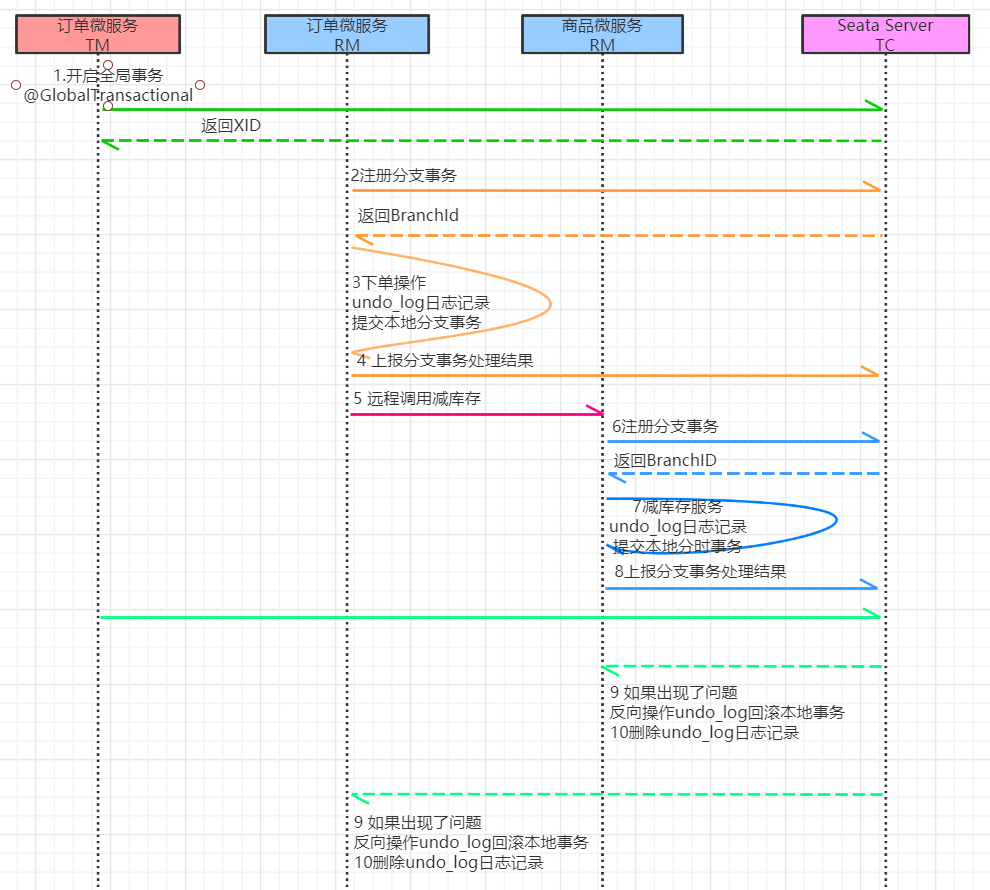

# 第十章 Seata--分布式事务  

## 10.1 分布式事务基础  

### 10.1.1 事务

​	事务指的就是一个操作单元，在这个操作单元中的所有操作最终要保持一致的行为，要么所有操作
都成功，要么所有的操作都被撤销。简单地说，事务提供一种“要么什么都不做，要么做全套”机制。

### 10.1.2 本地事物  

​	本地事物其实可以认为是数据库提供的事务机制。说到数据库事务就不得不说，数据库事务中的四
大特性:

- A：原子性(Atomicity)，一个事务中的所有操作，要么全部完成，要么全部不完成
- C：一致性(Consistency)，在一个事务执行之前和执行之后数据库都必须处于一致性状态
- I：隔离性(Isolation)，在并发环境中，当不同的事务同时操作相同的数据时，事务之间互不影响
- D：持久性(Durability)，指的是只要事务成功结束，它对数据库所做的更新就必须永久的保存下来  

​	数据库事务在实现时会将一次事务涉及的所有操作全部纳入到一个不可分割的执行单元，该执行单
元中的所有操作要么都成功，要么都失败，只要其中任一操作执行失败，都将导致整个事务的回滚  

### 10.1.3 分布式事务

​	分布式事务指事务的参与者、支持事务的服务器、资源服务器以及事务管理器分别位于不同的分布
式系统的不同节点之上。
简单的说，就是一次大的操作由不同的小操作组成，这些小的操作分布在不同的服务器上，且属于不同
的应用，分布式事务需要保证这些小操作要么全部成功，要么全部失败。
​	本质上来说，分布式事务就是为了保证不同数据库的数据一致性。  

### 10.1.4 分布式事务的场景

- 单体系统访问多个数据库
  一个服务需要调用多个数据库实例完成数据的增删改操作  

  

- 10.1.4 分布式事务的场景
  单体系统访问多个数据库
  一个服务需要调用多个数据库实例完成数据的增删改操作  

  

- 多个微服务访问多个数据库
  多个服务需要调用一个数据库实例完成数据的增删改操作  

  

## 10.2 分布式事务解决方案  

### 10.2.1 全局事务

​		全局事务基于DTP模型实现。 DTP是由X/Open组织提出的一种分布式事务模型——X/Open
Distributed Transaction Processing Reference Model。它规定了要实现分布式事务，需要三种角色：

- AP: Application 应用系统 (微服务)
- TM: Transaction Manager 事务管理器 (全局事务管理)
- RM: Resource Manager 资源管理器 (数据库)  

整个事务分成两个阶段:

- 阶段一: 表决阶段，所有参与者都将本事务执行预提交，并将能否成功的信息反馈发给协调者。 9
- 阶段二: 执行阶段，协调者根据所有参与者的反馈，通知所有参与者，步调一致地执行提交或者回
  滚。 


**优点**

- 提高了数据一致性的概率，实现成本较低  

**缺点**

- 单点问题: 事务协调者宕机
- 同步阻塞: 延迟了提交时间，加长了资源阻塞时间
- 数据不一致: 提交第二阶段，依然存在commit结果未知的情况，有可能导致数据不一致  

### 10.2.2 可靠消息服务  

​		基于可靠消息服务的方案是通过消息中间件保证上、下游应用数据操作的一致性。假设有A和B两个
系统，分别可以处理任务A和任务B。此时存在一个业务流程，需要将任务A和任务B在同一个事务中处
理。就可以使用消息中间件来实现这种分布式事务。  


**第一步: 消息由系统A投递到中间件**  

1. 在系统A处理任务A前，首先向消息中间件发送一条消息
2. 消息中间件收到后将该条消息持久化，但并不投递。持久化成功后，向A回复一个确认应答
3. 系统A收到确认应答后，则可以开始处理任务A
4. 任务A处理完成后，向消息中间件发送Commit或者Rollback请求。该请求发送完成后，对系统A而
   言，该事务的处理过程就结束了
5. 如果消息中间件收到Commit，则向B系统投递消息；如果收到Rollback，则直接丢弃消息。但是
   如果消息中间件收不到Commit和Rollback指令，那么就要依靠"超时询问机制"。  

> 超时询问机制
> 系统A除了实现正常的业务流程外，还需提供一个事务询问的接口，供消息中间件调
> 用。当消息中间件收到发布消息便开始计时，如果到了超时没收到确认指令，就会主动调用
> 系统A提供的事务询问接口询问该系统目前的状态。该接口会返回三种结果，中间件根据三
> 种结果做出不同反应 :
>
> - 提交:将该消息投递给系统B
> - 回滚:直接将条消息丢弃
> - 处理中:继续等待  

**第二步: 消息由中间件投递到系统B**
	消息中间件向下游系统投递完消息后便进入阻塞等待状态，下游系统便立即进行任务的处理，任务
处理完成后便向消息中间件返回应答。

- 如果消息中间件收到确认应答后便认为该事务处理完毕
- 如果消息中间件在等待确认应答超时之后就会重新投递，直到下游消费者返回消费成功响应为止。
  一般消息中间件可以设置消息重试的次数和时间间隔，如果最终还是不能成功投递，则需要手工干
  预。这里之所以使用人工干预，而不是使用让Ａ系统回滚，主要是考虑到整个系统设计的复杂度问
  题。  

基于可靠消息服务的分布式事务，前半部分使用异步，注重性能；后半部分使用同步，注重开发成本。  

### 10.2.3 最大努力通知  

​	最大努力通知也被称为定期校对，其实是对第二种解决方案的进一步优化。它引入了本地消息表来
记录错误消息，然后加入失败消息的定期校对功能，来进一步保证消息会被下游系统消费。  


**第一步: 消息由系统A投递到中间件**

1. 处理业务的同一事务中，向本地消息表中写入一条记录
2. 准备专门的消息发送者不断地发送本地消息表中的消息到消息中间件，如果发送失败则重试  

**第二步: 消息由中间件投递到系统B**

1. 消息中间件收到消息后负责将该消息同步投递给相应的下游系统，并触发下游系统的任务执行
2. 当下游系统处理成功后，向消息中间件反馈确认应答，消息中间件便可以将该条消息删除，从而该
   事务完成
3. 对于投递失败的消息，利用重试机制进行重试，对于重试失败的，写入错误消息表
4. 消息中间件需要提供失败消息的查询接口，下游系统会定期查询失败消息，并将其消费  

这种方式的优缺点：
**优点**： 一种非常经典的实现，实现了最终一致性。
**缺点**： 消息表会耦合到业务系统中，如果没有封装好的解决方案，会有很多杂活需要处理。  

### 10.2.4 TCC事务  

TCC即为Try Confirm Cancel，它属于补偿型分布式事务。 TCC实现分布式事务一共有三个步骤：

- Try：尝试待执行的业务
  这个过程并未执行业务，只是完成所有业务的一致性检查，并预留好执行所需的全部资源  
- Confirm：确认执行业务
  确认执行业务操作，不做任何业务检查， 只使用Try阶段预留的业务资源。通常情况下，采用TCC
  则认为 Confirm阶段是不会出错的。即：只要Try成功， Confirm一定成功。若Confirm阶段真的
  出错了，需引入重试机制或人工处理。  
- Cancel：取消待执行的业务
  取消Try阶段预留的业务资源。通常情况下，采用TCC则认为Cancel阶段也是一定成功的。若
  Cancel阶段真的出错了，需引入重试机制或人工处理。 


TCC两阶段提交与XA两阶段提交的区别是：
XA是资源层面的分布式事务，强一致性，在两阶段提交的整个过程中，一直会持有资源的锁。
TCC是业务层面的分布式事务，最终一致性，不会一直持有资源的锁。
TCC事务的优缺点：
**优点**：把数据库层的二阶段提交上提到了应用层来实现，规避了数据库层的2PC性能低下问题。
**缺点**： TCC的Try、 Confirm和Cancel操作功能需业务提供，开发成本高。  

## 10.3 Seata介绍  

​		2019 年 1 月，阿里巴巴中间件团队发起了开源项目 Fescar（Fast & EaSy Commit And Rollback），其愿景是让分布式事务的使用像本地事务的使用一样，简单和高效，并逐步解决开发者们遇到的分布式事务方面的所有难题。后来更名为 Seata，意为： Simple Extensible Autonomous
​		Transaction Architecture，是一套分布式事务解决方案。Seata的设计目标是对业务无侵入，因此从业务无侵入的2PC方案着手，在传统2PC的基础上演进。它把一个分布式事务理解成一个包含了若干分支事务的全局事务。全局事务的职责是协调其下管辖的分支事务达成一致，要么一起成功提交，要么一起失败回滚。此外，通常分支事务本身就是一个关系数据库的本地事务  


**Seata主要由三个重要组件组成：**

- TC： Transaction Coordinator 事务协调器，管理全局的分支事务的状态，用于全局性事务的提交
  和回滚。
- TM： Transaction Manager 事务管理器，用于开启、提交或者回滚全局事务。
- RM： Resource Manager 资源管理器，用于分支事务上的资源管理，向TC注册分支事务，上报分
  支事务的状态，接受TC的命令来提交或者回滚分支事务  


**Seata的执行流程如下:**

1. A服务的TM向TC申请开启一个全局事务， TC就会创建一个全局事务并返回一个唯一的XID
2. A服务的RM向TC注册分支事务，并及其纳入XID对应全局事务的管辖
3. A服务执行分支事务，向数据库做操作
4. A服务开始远程调用B服务，此时XID会在微服务的调用链上传播
5. B服务的RM向TC注册分支事务，并将其纳入XID对应的全局事务的管辖
6. B服务执行分支事务，向数据库做操作
7. 全局事务调用链处理完毕， TM根据有无异常向TC发起全局事务的提交或者回滚
8. TC协调其管辖之下的所有分支事务， 决定是否回滚  

**Seata实现2PC与传统2PC的差别：**

1. 架构层次方面，传统2PC方案的 RM 实际上是在数据库层， RM本质上就是数据库自身，通过XA协
   议实现，而 Seata的RM是以jar包的形式作为中间件层部署在应用程序这一侧的。
2. 两阶段提交方面，传统2PC无论第二阶段的决议是commit还是rollback，事务性资源的锁都要保
   持到Phase2完成才释放。而Seata的做法是在Phase1 就将本地事务提交，这样就可以省去Phase2
   持锁的时间，整体提高效率。  

## 10.4 Seata实现分布式事务控制  

本示例通过Seata中间件实现分布式事务，模拟电商中的下单和扣库存的过程
我们通过订单微服务执行下单操作，然后由订单微服务调用商品微服务扣除库存  


### 10.4.1 案例基本代码  

#### 10.4.1.1 修改order微服务  

controller  

```java
@RestController
@Slf4j
public class OrderController5 {
    @Autowired
    private OrderServiceImpl5 orderService;
    //下单
    @RequestMapping("/order/prod/{pid}")
    public Order order(@PathVariable("pid") Integer pid) {
        log.info("接收到{}号商品的下单请求,接下来调用商品微服务查询此商品信息", pid);
        return orderService.createOrder(pid);
    }
}
```

OrderService  

```java
@Service
@Slf4j
public class OrderServiceImpl5{
    @Autowired
    private OrderDao orderDao;
    @Autowired
    private ProductService productService;
    @Autowired
    private RocketMQTemplate rocketMQTemplate;
    @GlobalTransactional
    public Order createOrder(Integer pid) {
        //1 调用商品微服务,查询商品信息
        Product product = productService.findByPid(pid);
        log.info("查询到{}号商品的信息,内容是:{}", pid, JSON.toJSONString(product));
        //2 下单(创建订单)
        Order order = new Order();
        order.setUid(1);
        order.setUsername("测试用户");
        order.setPid(pid);
        order.setPname(product.getPname());
        order.setPprice(product.getPprice());
        order.setNumber(1);
        orderDao.save(order);
        log.info("创建订单成功,订单信息为{}", JSON.toJSONString(order));
        //3 扣库存
        productService.reduceInventory(pid, order.getNumber());
        //4 向mq中投递一个下单成功的消息
        rocketMQTemplate.convertAndSend("order-topic", order);
        return order;
    }
}
```

ProductService  

```java
@FeignClient(value = "service-product")
public interface ProductService {
    //减库存
    @RequestMapping("/product/reduceInventory")
    void reduceInventory(@RequestParam("pid") Integer pid, @RequestParam("num")
                         int num);
}
```

#### 10.4.1.2 修改Product微服务  

controller  

```java
//减少库存
@RequestMapping("/product/reduceInventory")
public void reduceInventory(Integer pid, int num) {
	productService.reduceInventory(pid, num);
}
```

service  	

```java
@Override
public void reduceInventory(Integer pid, int num) {
    Product product = productDao.findById(pid).get();
    product.setStock(product.getStock() - num);//减库存
    productDao.save(product);
}
```

#### 10.4.1.3 异常模拟  

在`ProductServiceImpl`的代码中模拟一个异常, 然后调用下单接口  

```java
@Override
public void reduceInventory(Integer pid, Integer number) {
    Product product = productDao.findById(pid).get();
    if (product.getStock() < number) {
        throw new RuntimeException("库存不足");
    } 
    int i = 1 / 0;
    product.setStock(product.getStock() - number);
    productDao.save(product);
}
```

### 10.4.2 启动Seata  

#### 10.4.2.1 下载seata  

下载地址： 

https://github.com/seata/seata/releases/v0.9/

#### 10.4.2.2 修改配置文件  

将下载得到的压缩包进行解压，进入conf目录，调整下面的配置文件：  

- **registry.conf**  

  ```conf
  registry {
      type = "nacos"
      nacos {
          serverAddr = "localhost"
          namespace = "public"
          cluster = "default"
      }
  } 
  config {
      type = "nacos"
      nacos {
          serverAddr = "localhost"
          namespace = "public"
          cluster = "default"
      }
  }
  ```

- **nacos-config.txt**  

  ```txt
  service.vgroup_mapping.service-product=default
  service.vgroup_mapping.service-order=default
  ```

这里的语法为：` service.vgroup_mapping.${your-service-gruop}=default` ，中间的
`${your-service-gruop} `为自己定义的服务组名称， 这里需要我们在程序的配置文件中配置。  

#### 10.4.2.3 初始化seata在nacos的配置  

```bash
# 初始化seata 的nacos配置
# 注意: 这里要保证nacos是已经正常运行的
cd conf
nacos-config.sh 127.0.0.1
```

执行成功后可以打开Nacos的控制台，在配置列表中，可以看到初始化了很多Group为SEATA_GROUP
的配置。  

#### 10.4.2.4 启动seata服务  

```bash
cd bin
seata-server.bat -p 9000 -m file
```

启动后在 Nacos 的服务列表下面可以看到一个名为 serverAddr 的服务。  

### 10.4.3 使用Seata实现事务控制

#### 10.4.3.1 初始化数据表

在我们的数据库中加入一张undo_log表,这是Seata记录事务日志要用到的表  

```sql
CREATE TABLE `undo_log`
(
    `id` BIGINT(20) NOT NULL AUTO_INCREMENT,
    `branch_id` BIGINT(20) NOT NULL,
    `xid` VARCHAR(100) NOT NULL,
    `context` VARCHAR(128) NOT NULL,
    `rollback_info` LONGBLOB NOT NULL,
    `log_status` INT(11) NOT NULL,
    `log_created` DATETIME NOT NULL,
    `log_modified` DATETIME NOT NULL,
    `ext` VARCHAR(100) DEFAULT NULL,
    PRIMARY KEY (`id`),
    UNIQUE KEY `ux_undo_log` (`xid`, `branch_id`)
) ENGINE = INNODB
AUTO_INCREMENT = 1
DEFAULT CHARSET = utf8;
```

#### 10.4.3.2 添加配置  

在需要进行分布式控制的微服务中进行下面几项配置:  

**添加依赖**  

```xml
<dependency>
    <groupId>com.alibaba.cloud</groupId>
    <artifactId>spring-cloud-starter-alibaba-seata</artifactId>
</dependency>
<dependency>
    <groupId>com.alibaba.cloud</groupId>
    <artifactId>spring-cloud-starter-alibaba-nacos-config</artifactId>
</dependency>
```

**DataSourceProxyConfig**  

Seata 是通过代理数据源实现事务分支的，所以需要配置 `io.seata.rm.datasource.DataSourceProxy` 的
Bean，且是 `@Primary`默认的数据源，否则事务不会回滚，无法实现分布式事务  

```java
@Configuration
public class DataSourceProxyConfig {
    @Bean
    @ConfigurationProperties(prefix = "spring.datasource")
    public DruidDataSource druidDataSource() {
        return new DruidDataSource();
    }
    @Primary
    @Bean
    public DataSourceProxy dataSource(DruidDataSource druidDataSource) {
        return new DataSourceProxy(druidDataSource);
    }
}
```

**registry.conf**  

在`resources`下添加Seata的配置文件 `registry.conf  `

```conf
registry {
    type = "nacos"
    nacos {
        serverAddr = "localhost"
        namespace = "public"
        cluster = "default"
    }
}
config {
    type = "nacos"
    nacos {
        serverAddr = "localhost"
        namespace = "public"
        cluster = "default"
    }
}
```

**bootstrap.yaml**  

```yaml
spring:
	application:
		name: service-product
	cloud:
		nacos:
			config:
				server-addr: localhost:8848 # nacos的服务端地址
				namespace: public
				group: SEATA_GROUP
		alibaba:
			seata:
				tx-service-group: ${spring.application.name}
```

#### 10.4.3.3 在order微服务开启全局事务  

```java
@GlobalTransactional//全局事务控制
public Order createOrder(Integer pid) {}
```

#### 10.4.3.4 测试  

再次下单测试

### 10.4.4 seata运行流程分析  



要点说明：
1、每个RM使用`DataSourceProxy`连接数据库，其目的是使用`ConnectionProxy`，使用数据源和数据连
接代理的目的就是在第一阶段将undo_log和业务数据放在一个本地事务提交，这样就保存了只要有业务
操作就一定有undo_log。
2、在第一阶段undo_log中存放了数据修改前和修改后的值，为事务回滚作好准备，所以第一阶段完成
就已经将分支事务提交，也就释放了锁资源。
3、 TM开启全局事务开始，将XID全局事务id放在事务上下文中，通过feign调用也将XID传入下游分支
事务，每个分支事务将自己的Branch ID分支事务ID与XID关联。
4、第二阶段全局事务提交， TC会通知各各分支参与者提交分支事务，在第一阶段就已经提交了分支事
务，这里各各参与者只需要删除undo_log即可，并且可以异步执行，第二阶段很快可以完成。
5、第二阶段全局事务回滚， TC会通知各各分支参与者回滚分支事务，通过 XID 和 Branch ID 找到相应
的回滚日志，通过回滚日志生成反向的 SQL 并执行，以完成分支事务回滚到之前的状态，如果回滚失
败则会重试回滚操作。  