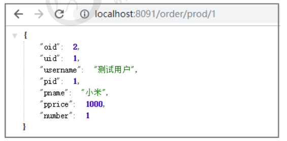

## **第二章 微服务环境搭建**

我们本次是使用的电商项目中的商品、订单、用户为案例进行讲解。

## **2.1** **案例准备**

### **2.1.1** **技术选型**

maven：3.3.9

数据库：MySQL 5.7

持久层: SpingData Jpa

其他: SpringCloud Alibaba 技术栈

### **2.1.2** **模块设计**

springcloud-alibaba 父工程

shop-common 公共模块【实体类】

shop-user 用户微服务 【端口: 807x】

shop-product 商品微服务 【端口: 808x】

shop-order 订单微服务 【端口: 809x】 


### **2.1.3** **微服务调用**

​	在微服务架构中，最常见的场景就是微服务之间的相互调用。我们以电商系统中常见的**用户下单**为

例来演示微服务的调用：客户向订单微服务发起一个下单的请求，在进行保存订单之前需要调用商品微

服务查询商品的信息。

我们一般把服务的主动调用方称为**服务消费者**，把服务的被调用方称为**服务提供者**。


## **2.2** **创建父工程**

创建一个maven工程，然后在pom.xml文件中添加下面内容

```xml
<?xml version="1.0" encoding="UTF-8"?>
<project xmlns="http://maven.apache.org/POM/4.0.0" xmlns:xsi="http://www.w3.org/2001/XMLSchema-instance"
         xsi:schemaLocation="http://maven.apache.org/POM/4.0.0 https://maven.apache.org/xsd/maven-4.0.0.xsd">
    <modelVersion>4.0.0</modelVersion>
    <groupId>com.neuedu</groupId>
    <artifactId>shop-parent</artifactId>
    <packaging>pom</packaging>
    <version>0.0.1-SNAPSHOT</version>
    <modules>
        <module>shop-common</module>
        <module>shop-user</module>
        <module>shop-product</module>
        <module>shop-order</module>
    </modules>
    <name>shop-parent</name>
    <description>Demo project for Spring Boot</description>

    <properties>
        <java.version>1.8</java.version>
        <project.build.sourceEncoding>UTF-8</project.build.sourceEncoding>
        <project.reporting.outputEncoding>UTF-8</project.reporting.outputEncoding>
        <spring-boot.version>2.3.4.RELEASE</spring-boot.version>
        <spring-cloud.version>Hoxton.SR6</spring-cloud.version>
        <spring-cloud-alibaba.version>2.2.1.RELEASE</spring-cloud-alibaba.version>
    </properties>


    <dependencyManagement>
        <dependencies>
            <dependency>
                <groupId>org.springframework.boot</groupId>
                <artifactId>spring-boot-dependencies</artifactId>
                <version>${spring-boot.version}</version>
                <type>pom</type>
                <scope>import</scope>
            </dependency>
            <dependency>
                <groupId>org.springframework.cloud</groupId>
                <artifactId>spring-cloud-dependencies</artifactId>
                <version>${spring-cloud.version}</version>
                <type>pom</type>
                <scope>import</scope>
            </dependency>
            <dependency>
                <groupId>com.alibaba.cloud</groupId>
                <artifactId>spring-cloud-alibaba-dependencies</artifactId>
                <version>${spring-cloud-alibaba.version}</version>
                <type>pom</type>
                <scope>import</scope>
            </dependency>
        </dependencies>
    </dependencyManagement>

    <build>
        <plugins>
            <plugin>
                <groupId>org.apache.maven.plugins</groupId>
                <artifactId>maven-compiler-plugin</artifactId>
                <version>3.8.1</version>
                <configuration>
                    <source>1.8</source>
                    <target>1.8</target>
                    <encoding>UTF-8</encoding>
                </configuration>
            </plugin>
            <plugin>
                <groupId>org.springframework.boot</groupId>
                <artifactId>spring-boot-maven-plugin</artifactId>
                <version>2.3.4.RELEASE</version>
            </plugin>
        </plugins>
    </build>

</project>

```

版本对应：


## **2.3** **创建基础模块**

### 1 创建 shop-common 模块，在pom.xml中添加依赖

```xml
<?xml version="1.0" encoding="UTF-8"?>
<project xmlns="http://maven.apache.org/POM/4.0.0" xmlns:xsi="http://www.w3.org/2001/XMLSchema-instance"
         xsi:schemaLocation="http://maven.apache.org/POM/4.0.0 http://maven.apache.org/xsd/maven-4.0.0.xsd">
    <parent>
        <artifactId>springcloud-alibaba</artifactId>
        <groupId>com.neuedu</groupId>
        <version>0.0.1-SNAPSHOT</version>
    </parent>
    <modelVersion>4.0.0</modelVersion>
    <artifactId>shop-common</artifactId>
    <dependencies>
       <dependency>
            <groupId>javax.persistence</groupId>
            <artifactId>persistence-api</artifactId>
            <version>1.0</version>
            <scope>compile</scope>
        </dependency>
        <dependency>
            <groupId>org.projectlombok</groupId>
            <artifactId>lombok</artifactId>
            <scope>provided</scope>
        </dependency>
        <dependency>
            <groupId>com.alibaba</groupId>
            <artifactId>fastjson</artifactId>
            <version>1.2.68</version>
        </dependency>
    </dependencies>
</project>
```

### 2 创建实体类

```java
@Entity(name = "shop_user")
@Data
public class User {
    @Id
    @GeneratedValue(strategy = GenerationType.IDENTITY)
    private Integer uid;//主键 
    private String username;

    //用户名 
    private String password;
    //密码 
    private String telephone;
    //手机号 
}
```

```java
//订单 
@Entity(name = "shop_order")
@Data
public class Order {
    @Id
    @GeneratedValue(strategy = GenerationType.IDENTITY)
    private Long oid;//订单id
    private Integer uid;//用户id
    private String username;//用户名
    private Integer pid;//商品id
    private String pname;//商品名称
    private Double pprice;//商品单价
    private Integer number;//购买数量
}
```

```java
//商品
@Entity(name = "shop_product")
@Data
public class Product {
    @Id
    @GeneratedValue(strategy = GenerationType.IDENTITY)
    private Integer pid;//主键
    private String pname;//商品名称
    private Double pprice;//商品价格
    private Integer stock;//库存
}
```

### 3 创建jpa 自定义dialect

为了保证建表使用utf-8

```java
public class UTF8MySql5Dialect extends MySQL5Dialect {
    @Override
    public String getTableTypeString() {
        return  " ENGINE=InnoDB DEFAULT CHARSET=utf8";
    }
}
```

## 2.4 **创建用户微服务**

步骤:

1 创建模块 导入依赖

2 创建SpringBoot主类

3 加入配置文件

4 创建必要的接口和实现类(controller service dao)

新建一个 shop-user 模块，然后进行下面操作

### 1 创建pom.xml

```xml
<?xml version="1.0" encoding="UTF-8"?>
<project xmlns="http://maven.apache.org/POM/4.0.0" xmlns:xsi="http://www.w3.org/2001/XMLSchema-instance"
         xsi:schemaLocation="http://maven.apache.org/POM/4.0.0 http://maven.apache.org/xsd/maven-4.0.0.xsd">
    <parent>
        <artifactId>springcloud-alibaba</artifactId>
        <groupId>com.neuedu</groupId>
        <version>1.0-SNAPSHOT</version>
    </parent>
    <modelVersion>4.0.0</modelVersion>
    <artifactId>shop-user</artifactId>
    <dependencies>
        <dependency>
            <groupId>com.neuedu</groupId>
            <artifactId>shop-common</artifactId>
            <version>0.0.1-SNAPSHOT</version>
        </dependency>
        <dependency>
            <groupId>org.springframework.boot</groupId>
            <artifactId>spring-boot-starter-web</artifactId>
        </dependency>
        <dependency>
            <groupId>org.springframework.boot</groupId>
            <artifactId>spring-boot-starter-data-jpa</artifactId>
        </dependency>
        <dependency>
            <groupId>mysql</groupId>
            <artifactId>mysql-connector-java</artifactId>
        </dependency>
    </dependencies>
</project>
```

### 2 编写主类

```java
@SpringBootApplication
public class UserApplication {
    public static void main(String[] args) {
        SpringApplication.run(UserApplication.class,args);
    }
}
```

### 3 创建配置文件

```yaml
server:
  port: 8071
spring:
  application:
    name: shop-user
  datasource:
    driver-class-name: com.mysql.cj.jdbc.Driver
    url: jdbc:mysql://localhost:3306/shopserver?createDatabaseIfNotExist=true&Timezone=UTC&useUnicode=true&characterEncoding=utf-8&useSSL=true
    username: root
    password: 1234
  jpa:
    hibernate:
      ddl-auto: update
    database-platform: com.neuedu.UTF8MySql5Dialect
```

## **2.5** **创建商品微服务**

### 1 创建一个名为 shop_product 的模块，并添加springboot依赖

```xml
<?xml version="1.0" encoding="UTF-8"?>
<project xmlns="http://maven.apache.org/POM/4.0.0" xmlns:xsi="http://www.w3.org/2001/XMLSchema-instance"
         xsi:schemaLocation="http://maven.apache.org/POM/4.0.0 http://maven.apache.org/xsd/maven-4.0.0.xsd">
    <parent>
        <artifactId>springcloud-alibaba</artifactId>
        <groupId>com.neuedu</groupId>
        <version>1.0-SNAPSHOT</version>
    </parent>
    <modelVersion>4.0.0</modelVersion>
    <artifactId>shop-product</artifactId>
    <dependencies>
        <dependency>
            <groupId>com.neuedu</groupId>
            <artifactId>shop-common</artifactId>
            <version>0.0.1-SNAPSHOT</version>
        </dependency>
        <dependency>
            <groupId>org.springframework.boot</groupId>
            <artifactId>spring-boot-starter-web</artifactId>
        </dependency>
        <dependency>
            <groupId>org.springframework.boot</groupId>
            <artifactId>spring-boot-starter-data-jpa</artifactId>
        </dependency>
        <dependency>
            <groupId>mysql</groupId>
            <artifactId>mysql-connector-java</artifactId>
        </dependency>
    </dependencies>
</project>
```

### 2 创建工程的主类

```java
package com.neuedu;
@SpringBootApplication 
public class ProductApplication { 
    public static void main(String[] args) { 		        		SpringApplication.run(ProductApplication.class, args); 
   }
}
```

### 3 创建配置文件application.yml

```yaml
server:
  port: 8081
spring:
  application:
    name: shop-product
  datasource:
    driver-class-name: com.mysql.cj.jdbc.Driver
    url: jdbc:mysql://localhost:3306/shopserver?createDatabaseIfNotExist=true&Timezone=UTC&useUnicode=true&characterEncoding=utf-8&useSSL=true
    username: root
    password: 1234
  jpa:
    hibernate:
      ddl-auto: update
    database-platform: com.neuedu.UTF8MySql5Dialect
```

### 4 创建ProductDao接口

```java
@Repository
public interface ProductDao extends JpaRepository<Product, Integer> {
}

```

### 5 创建ProductService接口和实现类

```java
@Service
public class ProductServiceImpl implements ProductService {

    @Autowired
    private ProductDao productDao;

    @Override
    public Product findByPid(Integer id){
        return productDao.findById(id).orElse(null);
    }
}
```

### 6 创建Controller

```java
package com.neuedu.controller;

import com.alibaba.fastjson.JSON;
import com.neuedu.domain.Product;
import com.neuedu.service.ProductService;
import lombok.extern.slf4j.Slf4j;
import org.springframework.beans.factory.annotation.Autowired;
import org.springframework.web.bind.annotation.PathVariable;
import org.springframework.web.bind.annotation.RequestMapping;
import org.springframework.web.bind.annotation.RequestParam;
import org.springframework.web.bind.annotation.RestController;

@RestController
@Slf4j
public class ProductController {

    @Autowired
    private ProductService productService;

    //商品信息查询
    @RequestMapping("/product/{pid}")
    public Product product(@PathVariable("pid") Integer pid) {
        log.info("接下来要进行{}号商品信息的查询", pid);
        Product product = productService.findByPid(pid);
        log.info("商品信息查询成功,内容为{}", JSON.toJSONString(product));
        return product;
    }

}

```

### 7 启动工程，等到数据库表创建完毕之后，加入测试数据

```sql
INSERT INTO shop_product VALUE(NULL,'小米','1000','5000');
INSERT INTO shop_product VALUE(NULL,'华为','2000','5000');
INSERT INTO shop_product VALUE(NULL,'苹果','3000','5000');
INSERT INTO shop_product VALUE(NULL,'OPPO','4000','5000');
```

### 8 通过浏览器访问服务


## **2.6** **创建订单微服务**

### 1 创建一个名为 shop-order 的模块,并添加springboot依赖

```xml
<?xml version="1.0" encoding="UTF-8"?>
<project xmlns="http://maven.apache.org/POM/4.0.0"
         xmlns:xsi="http://www.w3.org/2001/XMLSchema-instance"
         xsi:schemaLocation="http://maven.apache.org/POM/4.0.0 http://maven.apache.org/xsd/maven-4.0.0.xsd">
    <parent>
        <artifactId>springcloud-alibaba</artifactId>
        <groupId>com.neuedu</groupId>
        <version>1.0-SNAPSHOT</version>
    </parent>
    <modelVersion>4.0.0</modelVersion>

    <artifactId>shop-order</artifactId>
    <dependencies>
        <!--springboot-web-->
        <dependency>
            <groupId>org.springframework.boot</groupId>
            <artifactId>spring-boot-starter-web</artifactId>
        </dependency>
        <!--shop-common-->
        <dependency>
            <groupId>com.neuedu</groupId>
            <artifactId>shop-common</artifactId>
            <version>1.0-SNAPSHOT</version>
        </dependency>
    </dependencies>
</project>
```

### 2 创建工程的主类

```java
package com.neuedu;

import org.springframework.boot.SpringApplication;
import org.springframework.boot.autoconfigure.SpringBootApplication;
import org.springframework.cloud.client.discovery.EnableDiscoveryClient;
import org.springframework.cloud.client.loadbalancer.LoadBalanced;
import org.springframework.cloud.openfeign.EnableFeignClients;
import org.springframework.context.annotation.Bean;
import org.springframework.web.client.RestTemplate;

@SpringBootApplication
public class OrderApplication {

    public static void main(String[] args) {
        SpringApplication.run(OrderApplication.class);
    }
}
```

### 3 创建配置文件application.yml

```yml
server:
  port: 8091
spring:
  application:
    name: shop-order
  datasource:
    driver-class-name: com.mysql.cj.jdbc.Driver
    url: jdbc:mysql://192.168.134.101:3306/shopserver?Timezone=UTC&useUnicode=true&characterEncoding=utf-8&useSSL=true
    username: root
    password: 1234
  jpa:
    hibernate:
      ddl-auto: update
    database-platform: com.neuedu.UTF8MySql5Dialect
```

### 4 创建OrderDao接口

```java
public interface OrderDao extends JpaRepository<Order, Integer> {
}
```

### 5 创建OrderService接口和实现类

```java
@Service
public class OrderServiceImpl implements OrderService {

    @Autowired
    private OrderDao orderDao;

    @Override
    public void save(Order order) {
        orderDao.save(order);
    }
}
```

### 6 创建RestTemplate

```java
@SpringBootApplication
public class OrderApplication {

    public static void main(String[] args) {
        SpringApplication.run(OrderApplication.class);
    }

    @Bean
    public RestTemplate restTemplate() {
        return new RestTemplate();
    }
}
```

### 7 创建Controller

```java
package com.neuedu.controller;
@RestController
@Slf4j
public class OrderController {
    @Autowired
    private RestTemplate restTemplate;
    @Autowired
    private OrderService orderService;
    //准备买1件商品
    @GetMapping("/order/prod/{pid}")
    public Order order(@PathVariable("pid") Integer pid) {
        log.info(">>客户下单， 这时候要调用商品微服务查询商品信息");
        //通过restTemplate调用商品微服务
        Product product = restTemplate.getForObject(
        "http://localhost:8081/product/" + pid, Product.class);
        log.info(">>商品信息,查询结果:" + JSON.toJSONString(product));
        Order order = new Order();
        order.setUid(1);
        order.setUsername("测试用户");
        order.setPid(product.getPid());
        order.setPname(product.getPname());
        order.setPprice(product.getPprice());
        order.setNumber(1);
        orderService.save(order);
        return order;
    }
}
```

### 8 启动工程,通过浏览器访问服务进行测试



