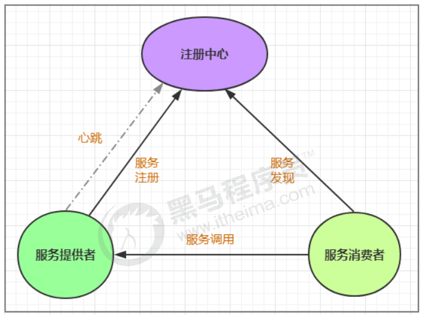
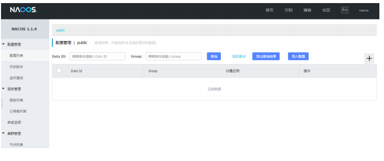
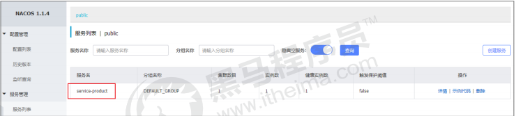
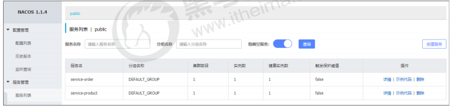
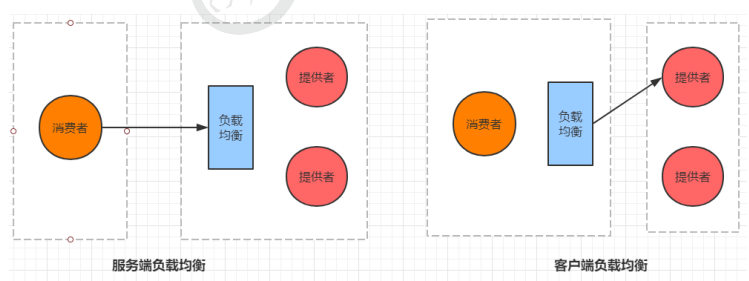
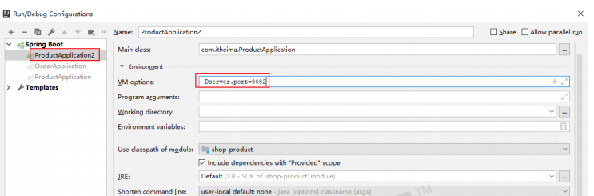
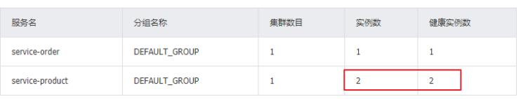

# **第三章** Nacos Discovery--服务治理

## **3.1** **服务治理介绍**

### **先来思考一个问题**

​	通过上一章的操作，我们已经可以实现微服务之间的调用。但是我们把服务提供者的网络地址

（ip，端口）等硬编码到了代码中，这种做法存在许多问题：

- 一旦服务提供者地址变化，就需要手工修改代码

- 一旦是多个服务提供者，无法实现负载均衡功能

- 一旦服务变得越来越多，人工维护调用关系困难

那么应该怎么解决呢， 这时候就需要通过注册中心动态的实现**服务治理**.

### **什么是服务治理**

服务治理是微服务架构中最核心最基本的模块。用于实现各个微服务的**自动化注册与发现**。

- **服务注册：**在服务治理框架中，都会构建一个注册中心，每个服务单元向注册中心登记自己提供服

  务的详细信息。并在注册中心形成一张服务的清单，服务注册中心需要以心跳的方式去监测清单中

  的服务是否可用，如果不可用，需要在服务清单中剔除不可用的服务。

- **服务发现：**服务调用方向服务注册中心咨询服务，并获取所有服务的实例清单，实现对具体服务实例的访问。



​	通过上面的调用图会发现，除了微服务，还有一个组件是**服务注册中心**，它是微服务架构非常重要

的一个组件，在微服务架构里主要起到了协调者的一个作用。注册中心一般包含如下几个功能：

1. 服务发现：
   - 服务注册：保存服务提供者和服务调用者的信息
   - 服务订阅：服务调用者订阅服务提供者的信息，注册中心向订阅者推送提供者的信息

2. 服务配置：
   - 配置订阅：服务提供者和服务调用者订阅微服务相关的配置
   - 配置下发：主动将配置推送给服务提供者和服务调用者

3. 服务健康检测

   检测服务提供者的健康情况，如果发现异常，执行服务剔除

### **常见的注册中心**

**Zookeeper**

​	zookeeper是一个分布式服务框架，是Apache Hadoop 的一个子项目，它主要是用来解决分布式

应用中经常遇到的一些数据管理问题，如：统一命名服务、状态同步服务、集群管理、分布式应用

配置项的管理等。

**Eureka**

​	Eureka是Springcloud Netflflix中的重要组件，主要作用就是做服务注册和发现。但是现在已经闭

源

**Consul**

​	Consul是基于GO语言开发的开源工具，主要面向分布式，服务化的系统提供服务注册、服务发现

和配置管理的功能。Consul的功能都很实用，其中包括：服务注册/发现、健康检查、Key/Value

存储、多数据中心和分布式一致性保证等特性。Consul本身只是一个二进制的可执行文件，所以

安装和部署都非常简单，只需要从官网下载后，在执行对应的启动脚本即可。

**Nacos**

​	Nacos是一个更易于构建云原生应用的动态服务发现、配置管理和服务管理平台。它是 Spring

Cloud Alibaba 组件之一，负责服务注册发现和服务配置，可以这样认为nacos=eureka+confifig。

## 3.2 nacos简介

​	Nacos 致力于帮助您发现、配置和管理微服务。Nacos 提供了一组简单易用的特性集，帮助您快速

实现动态服务发现、服务配置、服务元数据及流量管理。

从上面的介绍就可以看出，**nacos**的作用就是一个注册中心，用来管理注册上来的各个微服务。

### **3.3 nacos实战入门**

​	接下来，我们就在现有的环境中加入nacos，并将我们的两个微服务注册上去。

### **3.3.1** 搭建nacos环境

第1步: 安装nacos

```
下载地址: https://github.com/alibaba/nacos/releases 
下载zip格式的安装包，然后进行解压缩操作
```

第2步: 启动nacos

```shell
#切换目录
cd nacos/bin 
#命令启动 
startup.cmd -m standalone
```

第3步: 访问nacos

打开浏览器输入http://localhost:8848/nacos，即可访问服务， 默认密码是nacos/nacos



#### 3.3.3.1 docker搭建nacos

编写custom.properties

```properties
management.endpoints.web.exposure.include=*
```

编写如下docker-compose.yaml

```yaml
version: "3"
services:
  shop-db:
    image: mysql:5.7
    ports:
      - "3306:3306"
    restart:
      always
    volumes:
      - /opt/data:/var/lib/mysql/
    environment:
      MYSQL_ROOT_PASSWORD: 1234
  nacos-server:
    image: nacos/nacos-server
    environment:
      - PREFER_HOST_MODE=hostname
      - MODE=standalone
    restart:
      always
    volumes:
      - /opt/nacos/standalone-logs/:/home/nacos/logs
      - ./nacos/custom.properties:/home/nacos/init.d/custom.properties
    ports:
      - "8848:8848"

```

执行命令`docker-compose up -d`

### **3.3.2** 将商品微服务注册到nacos

接下来开始修改 shop-product 模块的代码， 将其注册到nacos服务上

1 在pom.xml中添加nacos的依赖

```xml
<!--nacos客户端--> 
<dependency> 
    <groupId>com.alibaba.cloud</groupId>
    <artifactId>spring-cloud-starter-alibaba-nacos-discovery</artifactId> 
</dependency>
```

2 在主类上添加**@EnableDiscoveryClient**注解

```java
@SpringBootApplication 
@EnableDiscoveryClient 
public class ProductApplication
```

3 在application.yml中添加nacos服务的地址

```yaml
spring: 
	cloud:
    	nacos: 
    		discovery: 
    			server-addr: 127.0.0.1:8848
```

4 启动服务， 观察nacos的控制面板中是否有注册上来的商品微服务



### **3.3.3** 将订单微服务注册到nacos

接下来开始修改 shop_order 模块的代码， 将其注册到nacos服务上

1 在pom.xml中添加nacos的依赖

```xml
<!--nacos客户端--> 
<dependency> 
    <groupId>com.alibaba.cloud</groupId> 
    <artifactId>spring-cloud-starter-alibaba-nacos-discovery</artifactId> 
</dependency>
```

2 在主类上添加**@EnableDiscoveryClient**注解

```java
@SpringBootApplication
@EnableDiscoveryClient 
public class OrderApplication
```

3 在application.yml中添加nacos服务的地址

```yaml
spring:
	cloud:
		nacos:
			discovery:
				server-addr: 127.0.0.1:8848
```

4 修改OrderController， 实现微服务调用

```java
@RestController
@Slf4j
public class OrderController {
    @Autowired
    private RestTemplate restTemplate;
    @Autowired
    private OrderService orderService;
    @Autowired
    private DiscoveryClient discoveryClient;
    //准备买1件商品
    @GetMapping("/order/prod/{pid}")
    public Order order(@PathVariable("pid") Integer pid) {
        log.info(">>客户下单， 这时候要调用商品微服务查询商品信息");
        //从nacos中获取服务地址
        ServiceInstance serviceInstance =
        discoveryClient.getInstances("shop-product").get(0);
        String url = serviceInstance.getHost() + ":" +
        serviceInstance.getPort();
        log.info(">>从nacos中获取到的微服务地址为:" + url);
        //通过restTemplate调用商品微服务
        Product product = restTemplate.getForObject(
        "http://" + url + "/product/" + pid, Product.class);
        log.info(">>商品信息,查询结果:" + JSON.toJSONString(product));
        Order order = new Order();
        order.setUid(1);
        order.setUsername("测试用户");
        order.setPid(product.getPid());
        order.setPname(product.getPname());
        order.setPprice(product.getPprice());
        order.setNumber(1);
        orderService.save(order);
        return order;
    }
}
```

> DiscoveryClient是专门负责服务注册和发现的，我们可以通过它获取到注册到注册中心的所有服
>
> 务

5 启动服务， 观察nacos的控制面板中是否有注册上来的订单微服务，然后通过访问消费者服务验证调

用是否成功



## **3.4** **实现服务调用的负载均衡**

### **3.4.1** 什么是负载均衡

通俗的讲， 负载均衡就是将负载（工作任务，访问请求）进行分摊到多个操作单元（服务器,组件）上

进行执行。

根据负载均衡发生位置的不同,一般分为**服务端负载均衡**和**客户端负载均衡**。

服务端负载均衡指的是发生在服务提供者一方,比如常见的nginx负载均衡

而客户端负载均衡指的是发生在服务请求的一方，也就是在发送请求之前已经选好了由哪个实例处理请

求.



我们在微服务调用关系中一般会选择客户端负载均衡，也就是在服务调用的一方来决定服务由哪个提供

者执行。

### **3.4.2** **自定义实现负载均衡**

1 通过idea再启动一个 shop-product 微服务，设置其端口为8082



2 通过nacos查看微服务的启动情况



3 修改 shop-order 的代码，实现负载均衡

```java
@RestController
@Slf4j
public class OrderController {
    @Autowired
    private RestTemplate restTemplate;
    @Autowired
    private OrderService orderService;
    @Autowired
    private DiscoveryClient discoveryClient;
    //准备买1件商品
    @GetMapping("/order/prod/{pid}")
    public Order order(@PathVariable("pid") Integer pid) {
        log.info(">>客户下单， 这时候要调用商品微服务查询商品信息");
        //从nacos中获取服务地址
        //自定义规则实现随机挑选服务第3步：启动两个服务提供者和一个服务消费者，多访问几次消费者测试效果
        List<ServiceInstance> instances = discoveryClient.getInstances("shop-product");
        int index = new Random().nextInt(instances.size());
        ServiceInstance serviceInstance = instances.get(index);
        String url = serviceInstance.getHost() + ":" +
        serviceInstance.getPort();
        log.info(">>从nacos中获取到的微服务地址为:" + url);
        //通过restTemplate调用商品微服务
        Product product = restTemplate.getForObject("http://" + url +
        "/product/" + pid, Product.class);
        log.info(">>商品信息， 查询结果:" + JSON.toJSONString(product));
        Order order = new Order();
        order.setUid(1);
        order.setUsername("测试用户");
        order.setPid(product.getPid());
        order.setPname(product.getPname());
        order.setPprice(product.getPprice());
        order.setNumber(1);
        orderService.save(order);
        return order;
    }
}

```

第3步：启动两个服务提供者和一个服务消费者，多访问几次消费者测试效果  


### 3.4.3 基于Ribbon实现负载均衡  

**Ribbon是Spring Cloud的一个组件， 它可以让我们使用一个注解就能轻松的搞定负载均衡**
第1步：在RestTemplate 的生成方法上添加@LoadBalanced注解  

```java
@Bean
@LoadBalanced
public RestTemplate restTemplate() {
	return new RestTemplate();
}
```

第2步：修改服务调用的方法  

```java
@RestController
@Slf4j
public class OrderController {
    @Autowired
    private RestTemplate restTemplate;
    @Autowired
    private OrderService orderService;
    //准备买1件商品
    @GetMapping("/order/prod/{pid}")
    public Order order(@PathVariable("pid") Integer pid) {
    log.info(">>客户下单， 这时候要调用商品微服务查询商品信息");
    //直接使用微服务名字， 从nacos中获取服务地址
    String url = "shop-product";
    //通过restTemplate调用商品微服务
    Product product = restTemplate.getForObject(
    "http://" + url + "/product/" + pid, Product.class);
    log.info(">>商品信息， 查询结果:" + JSON.toJSONString(product));
    Order order = new Order();
    order.setUid(1);
    order.setUsername("测试用户");
    order.setPid(product.getPid());
    order.setPname(product.getPname());
    order.setPprice(product.getPprice());
    order.setNumber(1);
    orderService.save(order);
    return order;
    }
}
```

#### Ribbon支持的负载均衡策略  

​	Ribbon内置了多种负载均衡策略,内部负载均衡的顶级接口为`com.netflix.loadbalancer.IRule` , 具体的负载策略如下图所示:  

| 策略名                    | 策略描述                                                     | 实现说明                                                     |
| ------------------------- | ------------------------------------------------------------ | ------------------------------------------------------------ |
| BestAvailableRule         | 选择一个最小的并发 请求的server                              | 策略描述：选择一个并发量最小的server返回。如何判断并发量最小呢？ServerStats有个属性activeRequestCount，这个属性记录的就是server的并发量。轮询所有的server，选择其中activeRequestCount最小的那个server，就是并发量最小的服务节点. |
| AvailabilityFilteringRule | 过滤掉那些因为一直 连接失败的被标记为 circuit tripped的后 端server，并过滤掉 那些高并发的的后端 server（active connections 超过配 置的阈值） | 策略描述：过滤掉连接失败的服务节点，并且过滤掉高并发的服务节点，然后从健康的服务节点中，使用轮询策略选出一个节点返回。 |
| WeightedResponseTimeRule  | 根据相应时间分配一 个weight，相应时 间越长， weight越 小，被选中的可能性 越低。 | 策略描述：根据响应时间，分配一个权重weight，响应时间越长，weight越小，被选中的可能性越低。 |
| RetryRule                 | 对选定的负载均衡策 略机上重试机制。                          | 轮询失败重试策略（RetryRule）是这样工作的，首先使用轮询策略进行负载均衡，如果轮询失败，则再使用轮询策略进行一次重试，相当于重试下一个节点，看下一个节点是否可用，如果再失败，则直接返回失败。 |
| RoundRobinRule            | 轮询方式轮询选择 server                                      | 轮询策略理解起来比较简单，就是拿到所有的server集合，然后根据id进行遍历。这里的id是ip+端口 |
| RandomRule                | 随机选择一个server                                           | 随机策略：使用jdk自带的随机数生成工具，生成一个随机数，然后去可用服务列表中拉取服务节点Server。如果当前节点不可用，则进入下一轮随机策略，直到选到可用服务节点为止。 |
| ZoneAvoidanceRule         | 复合判断server所在 区域的性能和server 的可用性选择server     | 使用ZoneAvoidancePredicate和 AvailabilityPredicate来判断是否选择 某个server，前一个判断判定一个 zone的运行性能是否可用，剔除不可 用的zone（的所有server）， AvailabilityPredicate用于过滤掉连接 数过多的Server。 |


我们可以通过修改配置来调整Ribbon的负载均衡策略，具体代码如下  

```yaml
shop-product: # 调用的提供者的名称
	ribbon:
		NFLoadBalancerRuleClassName: com.netflix.loadbalancer.RandomRule
```

并且注册策略到ioc中

```java

@Bean
public IRule ribbonRule() {
    return new RandomRule();//这里配置策略，和配置文件对应
}
```


## 3.5 基于Feign实现服务调用  

### 3.5.1 什么是Feign

​	Feign是Spring Cloud提供的一个声明式的伪Http客户端， 它使得调用远程服务就像调用本地服务
一样简单， 只需要创建一个接口并添加一个注解即可。
​	Nacos很好的兼容了Feign， Feign默认集成了 Ribbon， 所以在Nacos下使用Fegin默认就实现了负
载均衡的效果。  

### 3.5.2 Feign的使用

#### 1 加入Fegin的依赖  

```xml
<!--fegin组件-->
<dependency>
    <groupId>org.springframework.cloud</groupId>
    <artifactId>spring-cloud-starter-openfeign</artifactId>
</dependency>
```

#### 2 在主类上添加Fegin的注解  

```java
@SpringBootApplication
@EnableDiscoveryClient
@EnableFeignClients//开启Fegin
public class OrderApplication {}
```

#### 3 创建一个service， 并使用Fegin实现微服务调用  

```java
@FeignClient("shop-product")//声明调用的提供者的name
public interface ProductService {
    //指定调用提供者的哪个方法
    //@FeignClient+@GetMapping 就是一个完整的请求路径 http://serviceproduct/product/{pid}
    @GetMapping(value = "/product/{pid}")
    Product findByPid(@PathVariable("pid") Integer pid);
}
```

#### 4 修改controller代码，并启动验证  

 ```java
@RestController
@Slf4j
public class OrderController {
    @Autowired
    private OrderService orderService;
    @Autowired
    private ProductService productService;

    //准备买1件商品
    @GetMapping("/order/prod/{pid}")
    public Order order(@PathVariable("pid") Integer pid) {
        log.info(">>客户下单,这时候要调用商品微服务查询商品信息");
        //通过fegin调用商品微服务
        Product product = productService.findByPid(pid);
        log.info(">>商品信息,查询结果:" + JSON.toJSONString(product));
        Order order = new Order();
        order.setUid(1);
        order.setUsername("测试用户");
        order.setPid(product.getPid());
        order.setPname(product.getPname());
        order.setPprice(product.getPprice());
        order.setNumber(1);
        orderService.save(order);
        return order;
    }
}
 ```

#### 5 重启order微服务,查看效果  