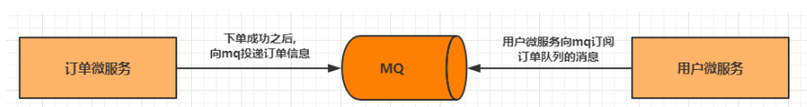

# 第七章 Rocketmq--消息驱动  

## 7.1 MQ简介  

### 7.1.1 什么是MQ  

​	MQ（Message Queue）是一种跨进程的通信机制，用于传递消息。通俗点说，就是一个先进先出的数
据结构。  


### 7.1.2 MQ的应用场景  

#### 7.1.2.1 异步解耦  

最常见的一个场景是用户注册后，需要发送注册邮件和短信通知，以告知用户注册成功。传统的做法如
下：  


​	此架构下注册、邮件、短信三个任务全部完成后，才返回注册结果到客户端，用户才能使用账号登录。
但是对于用户来说，注册功能实际只需要注册系统存储用户的账户信息后，该用户便可以登录，而后续
的注册短信和邮件不是即时需要关注的步骤。
​	所以实际当数据写入注册系统后，注册系统就可以把其他的操作放入对应的消息队列 MQ 中然后马上返
回用户结果，由消息队列 MQ 异步地进行这些操作。架构图如下：  


异步解耦是消息队列 MQ 的主要特点，主要目的是减少请求响应时间和解耦。主要的使用场景就是将**比**
**较耗时而且不需要即时（同步）返回结果的操作作为消息放入消息队列**。同时，由于使用了消息队列
MQ，只要保证消息格式不变，消息的发送方和接收方并不需要彼此联系，也不需要受对方的影响，即
解耦合。  

#### 7.1.2.2 流量削峰  

​	流量削峰也是消息队列 MQ 的常用场景，一般在秒杀或团队抢购(高并发)活动中使用广泛。  

​	在秒杀或团队抢购活动中，由于用户请求量较大，导致流量暴增，秒杀的应用在处理如此大量的访问流
量后，下游的通知系统无法承载海量的调用量，甚至会导致系统崩溃等问题而发生漏通知的情况。为解
决这些问题，可在应用和下游通知系统之间加入消息队列 MQ。  


秒杀处理流程如下所述：

1. 用户发起海量秒杀请求到秒杀业务处理系统。
2. 秒杀处理系统按照秒杀处理逻辑将满足秒杀条件的请求发送至消息队列 MQ。
3. 下游的通知系统订阅消息队列 MQ 的秒杀相关消息，再将秒杀成功的消息发送到相应用户。
4. 用户收到秒杀成功的通知。  

### 7.1.3 常见的MQ产品  

目前业界有很多MQ产品，比较出名的有下面这些：  

- ZeroMQ
  号称最快的消息队列系统，尤其针对大吞吐量的需求场景。扩展性好，开发比较灵活，采用C语言
  实现，实际上只是一个socket库的重新封装，如果做为消息队列使用，需要开发大量的代码。
  ZeroMQ仅提供非持久性的队列，也就是说如果down机，数据将会丢失。
- RabbitMQ
  使用erlang语言开发，性能较好，适合于企业级的开发。但是不利于做二次开发和维护。
- ActiveMQ
  历史悠久的Apache开源项目。已经在很多产品中得到应用，实现了JMS1.1规范，可以和springjms轻松融合，实现了多种协议，支持持久化到数据库，对队列数较多的情况支持不好。
- RocketMQ
  阿里巴巴的MQ中间件，由java语言开发，性能非常好，能够撑住双十一的大流量，而且使用起来
  很简单。
- Kafka
  Kafka是Apache下的一个子项目，是一个高性能跨语言分布式Publish/Subscribe消息队列系统，
  相对于ActiveMQ是一个非常轻量级的消息系统，除了性能非常好之外，还是一个工作良好的分布
  式系统  

## 7.2 RocketMQ入门  

​		RocketMQ是阿里巴巴开源的分布式消息中间件，现在是Apache的一个顶级项目。在阿里内部使用
非常广泛，已经经过了"双11"这种万亿级的消息流转。  

### 7.2.1 RocketMQ环境搭建  

接下来我们先在linux平台下安装一个RocketMQ的服务  

> https://www.jianshu.com/p/706588323276
>
> docker安装方式

#### 7.2.1.1 环境准备  

##### 下载RocketMQ

http://rocketmq.apache.org/release_notes/release-notes-4.4.0/  

##### 环境要求  

- Linux 64位操作系统
- 64bit JDK 1.8+  

#### 7.2.1.2 安装RocketMQ  

1 上传文件到Linux系统  

```bash
[root@neuedu rocketmq]# ls /usr/local/src/
rocketmq-all-4.4.0-bin-release.zip
```

2 解压到安装目录  

```bash
[root@neuedu src]# unzip rocketmq-all-4.4.0-bin-release.zip
[root@neuedu src]# mv rocketmq-all-4.4.0-bin-release ../rocketmq
```

#### 7.2.1.3 启动RocketMQ  

1切换到安装目录  

```bash
[root@neuedu rocketmq]# ls
benchmark bin conf lib LICENSE NOTICE README.md
```

2 启动NameServer  

```bash
[root@neuedu rocketmq]# nohup ./bin/mqnamesrv &
[1] 1467
# 只要进程不报错,就应该是启动成功了,可以查看一下日志
[root@neuedu rocketmq]# tail -f /root/logs/rocketmqlogs/namesrv.log
```

3 启动Broker  

```bash
# 编辑bin/runbroker.sh 和 bin/runserver.sh文件,修改里面的
# JAVA_OPT="${JAVA_OPT} -server -Xms8g -Xmx8g -Xmn4g"
# 为JAVA_OPT="${JAVA_OPT} -server -Xms256m -Xmx256m -Xmn128m"
[root@neuedu rocketmq]# nohup bin/mqbroker -n localhost:9876 &
[root@neuedu rocketmq]# tail -f /root/logs/rocketmqlogs/broker.log
```

#### 7.2.1.4 测试RocketMQ  

1 测试消息发送  

```bash
[root@neuedu rocketmq]# export NAMESRV_ADDR=localhost:9876
[root@neuedu rocketmq]# bin/tools.sh org.apache.rocketmq.example.quickstart.Produce
```

2 测试消息接收  

```bash
[root@neuedu rocketmq]# bin/mqshutdown broker
[root@neuedu rocketmq]# bin/mqshutdown namesrv
```

### 7.2.2 RocketMQ的架构及概念  


如上图所示，整体可以分成4个角色，分别是： NameServer， Broker， Producer， Consumer。  

- Broker(邮递员)  

  Broker是RocketMQ的核心，负责消息的接收，存储，投递等功能  

- NameServer(邮局)
  消息队列的协调者， Broker向它注册路由信息，同时Producer和Consumer向其获取路由信息  

- Producer(寄件人)
  消息的生产者，需要从NameServer获取Broker信息，然后与Broker建立连接，向Broker发送消
  息  

- Consumer(收件人)  

  消息的消费者，需要从NameServer获取Broker信息，然后与Broker建立连接，从Broker获取消
  息  

- Topic(地区)
  用来区分不同类型的消息，发送和接收消息前都需要先创建Topic，针对Topic来发送和接收消息  

- Message Queue(邮件)
  为了提高性能和吞吐量，引入了Message Queue，一个Topic可以设置一个或多个Message
  Queue，这样消息就可以并行往各个Message Queue发送消息，消费者也可以并行的从多个
  Message Queue读取消息  

- Message
  Message 是消息的载体。  

- Producer Group
  生产者组，简单来说就是多个发送同一类消息的生产者称之为一个生产者组。  

- Consumer Group
  消费者组，消费同一类消息的多个 consumer 实例组成一个消费者组  

### 7.2.3 RocketMQ控制台安装  

1 下载  

```bash
# 在git上下载下面的工程 rocketmq-console-1.0.0
https://github.com/apache/rocketmq-externals/releases
```

2 修改配置文件  

```bash
# 修改配置文件 rocketmq-console\src\main\resources\application.properties
server.port=7777 #项目启动后的端口号
rocketmq.config.namesrvAddr=192.168.109.131:9876 #nameserv的地址， 注意防火墙要开启
9876端口
```

3 打成jar包，并启动  

```bash
# 进入控制台项目， 将工程打成jar包
mvn clean package -Dmaven.test.skip=true
# 启动控制台
java -jar target/rocketmq-console-ng-1.0.0.jar
```

4 访问控制台  


## 7.3 消息发送和接收演示  

接下来我们使用Java代码来演示消息的发送和接收  

```xml
<dependency>
    <groupId>org.apache.rocketmq</groupId>
    <artifactId>rocketmq-spring-boot-starter</artifactId>
    <version>2.0.2</version>
</dependency>
```

### 7.3.1 发送消息  

消息发送步骤:  

1. 创建消息生产者, 指定生产者所属的组名
2. 指定Nameserver地址
3. 启动生产者
4. 创建消息对象，指定主题、标签和消息体
5. 发送消息
6. 关闭生产者  

```java
//发送消息
public class RocketMQSendTest {
    public static void main(String[] args) throws Exception {
        //1. 创建消息生产者, 指定生产者所属的组名
        DefaultMQProducer producer = new DefaultMQProducer("myproducer-group");
        //2. 指定Nameserver地址
        producer.setNamesrvAddr("192.168.109.131:9876");
        //3. 启动生产者
        producer.start();
        //4. 创建消息对象， 指定主题、 标签和消息体
        Message msg = new Message("myTopic", "myTag",
                                  ("RocketMQ Message").getBytes());
        //5. 发送消息
        SendResult sendResult = producer.send(msg,10000);
        System.out.println(sendResult);
        //6. 关闭生产者
        producer.shutdown();
    }
}
```

### 7.3.2 接收消息  

消息接收步骤:

1. 创建消息消费者, 指定消费者所属的组名
2. 指定Nameserver地址
3. 指定消费者订阅的主题和标签
4. 设置回调函数，编写处理消息的方法
5. 启动消息消费者  

```java
//接收消息
public class RocketMQReceiveTest {
    public static void main(String[] args) throws MQClientException {
        //1. 创建消息消费者, 指定消费者所属的组名
        DefaultMQPushConsumer consumer = new DefaultMQPushConsumer("myconsumergroup");
        //2. 指定Nameserver地址
        consumer.setNamesrvAddr("192.168.109.131:9876");
        //3. 指定消费者订阅的主题和标签
        consumer.subscribe("myTopic", "*");
        //4. 设置回调函数， 编写处理消息的方法
        consumer.registerMessageListener(new MessageListenerConcurrently() {
            @Override
            public ConsumeConcurrentlyStatus consumeMessage(List<MessageExt>
                                                            msgs,
                                                            ConsumeConcurrentlyContext
                                                            context) {
                System.out.println("Receive New Messages: " + msgs);
                //返回消费状态
                return ConsumeConcurrentlyStatus.CONSUME_SUCCESS;
            }
        });
        //5. 启动消息消费者
        consumer.start();
        System.out.println("Consumer Started.");
    }
}
```

## 7.4 案例  

接下来我们模拟一种场景: 下单成功之后，向下单用户发送短信。设计图如下：  



### 7.4.1 订单微服务发送消息  

1 在 shop-order 中添加rocketmq的依赖  

```xml
<!--rocketmq-->
<dependency>
	<groupId>org.apache.rocketmq</groupId>
	<artifactId>rocketmq-spring-boot-starter</artifactId>
	<version>2.0.2</version>
</dependency>
<dependency>
    <groupId>org.apache.rocketmq</groupId>
    <artifactId>rocketmq-client</artifactId>
    <version>4.4.0</version>
</dependency>
```

2 添加配置  

```yaml
rocketmq:
	name-server: 192.168.109.131:9876 #rocketMQ服务的地址
	producer:
		group: shop-order # 生产者组
```

3 编写测试代码  

```java
@RestController
@Slf4j
public class OrderController2 {
    @Autowired
    private OrderService orderService;
    @Autowired
    private ProductService productService;
    @Autowired
    private RocketMQTemplate rocketMQTemplate;
    //准备买1件商品
    @GetMapping("/order/prod/{pid}")
    public Order order(@PathVariable("pid") Integer pid) {
        log.info(">>客户下单,这时候要调用商品微服务查询商品信息");
        //通过fegin调用商品微服务
        Product product = productService.findByPid(pid);
        if (product == null){
            Order order = new Order();
            order.setPname("下单失败");
            return order;
        } 
        log.info(">>商品信息,查询结果:" + JSON.toJSONString(product));
        Order order = new Order();
        order.setUid(1);
        order.setUsername("测试用户");
        order.setPid(product.getPid());
        order.setPname(product.getPname());
        order.setPprice(product.getPprice());
        order.setNumber(1);
        orderService.save(order);
        //下单成功之后,将消息放到mq中
        rocketMQTemplate.convertAndSend("order-topic", order);
        return order;
    }
}
```

### 7.4.2 用户微服务订阅消息  

1 修改 shop-user 模块配置  

```xml
<?xml version="1.0" encoding="UTF-8"?>
<project xmlns="http://maven.apache.org/POM/4.0.0"
xmlns:xsi="http://www.w3.org/2001/XMLSchema-instance"
xsi:schemaLocation="http://maven.apache.org/POM/4.0.0
http://maven.apache.org/xsd/maven-4.0.0.xsd">
<parent>
    <artifactId>springcloud-alibaba</artifactId>
    <groupId>com.neuedu</groupId>
    <version>1.0-SNAPSHOT</version>
</parent>
<modelVersion>4.0.0</modelVersion>
<artifactId>shop-user</artifactId>
<dependencies>
    <dependency>
        <groupId>com.neuedu</groupId>
        <artifactId>shop-common</artifactId>
        <version>1.0-SNAPSHOT</version>
    </dependency>
    <dependency>
    	<groupId>com.alibaba.cloud</groupId>
        <artifactId>spring-cloud-starter-alibaba-nacosdiscovery</artifactId>
    </dependency>
    <dependency>
        <groupId>org.apache.rocketmq</groupId>
        <artifactId>rocketmq-spring-boot-starter</artifactId>
        <version>2.0.2</version>
    </dependency>
    <dependency>
        <groupId>org.apache.rocketmq</groupId>
        <artifactId>rocketmq-client</artifactId>
        <version>4.4.0</version>
    </dependency>
</dependencies>
</project>
```

2 修改主类  

```java
@SpringBootApplication
@EnableDiscoveryClient
public class UserApplication {
    public static void main(String[] args) {
        SpringApplication.run(UserApplication.class, args);
    }
}
```

3 修改配置文件  

```yaml
server:
	port: 8071
spring:
	application:
		name: service-user
	datasource:
		driver-class-name: com.mysql.jdbc.Driver
		url: jdbc:mysql:///shop?serverTimezone=UTC&useUnicode=true&characterEncoding=utf-8&useSSL=true
		username: root
		password: root
	jpa:
		properties:
			hibernate:
				hbm2ddl:
					auto: update
				dialect: org.hibernate.dialect.MySQL5InnoDBDialect
	cloud:
		nacos:
			discovery:
				server-addr: 127.0.0.1:8848
rocketmq:
	name-server: 192.168.109.131:9876
```

4 编写消息接收服务  

```java
package com.neuedu.service;
//发送短信的服务
@Slf4j
@Service
@RocketMQMessageListener(consumerGroup = "shop-user", topic = "order-topic")
public class SmsService implements RocketMQListener<Order> {
    @Override
    public void onMessage(Order order) {
        log.info("收到一个订单信息{},接下来发送短信", JSON.toJSONString(order));
    }
}
```

5 启动服务，执行下单操作，观看后台输出  

## 7.5 发送不同类型的消息  

### 7.5.1 普通消息

RocketMQ提供三种方式来发送普通消息：可靠同步发送、可靠异步发送和单向发送。  

#### 可靠同步发送

> 同步发送是指消息发送方发出数据后，会在收到接收方发回响应之后才发下一个数据包的通讯方
> 式。
> 此种方式应用场景非常广泛，例如重要通知邮件、报名短信通知、营销短信系统等  

#### 可靠异步发送

> 异步发送是指发送方发出数据后，不等接收方发回响应，接着发送下个数据包的通讯方式。发送
> 方通过回调接口接收服务器响应，并对响应结果进行处理。
> 异步发送一般用于链路耗时较长，对 RT 响应时间较为敏感的业务场景，例如用户视频上传后通知
> 启动转码服务，转码完成后通知推送转码结果等。

#### 单向发送

> 单向发送是指发送方只负责发送消息，不等待服务器回应且没有回调函数触发，即只发送请求不
> 等待应答。
> 适用于某些耗时非常短，但对可靠性要求并不高的场景，例如日志收集。  

```xml
<!--依赖-->
<dependency>
    <groupId>org.springframework.boot</groupId>
    <artifactId>spring-boot-starter-test</artifactId>
</dependency>
<dependency>
    <groupId>junit</groupId>
    <artifactId>junit</artifactId>
</dependency>
```

```java
//测试
@RunWith(SpringRunner.class)
@SpringBootTest(classes = OrderApplication.class)
public class MessageTypeTest {
    @Autowired
    private RocketMQTemplate rocketMQTemplate;
    //同步消息
    @Test
    public void testSyncSend() {
        //参数一: topic， 如果想添加tag 可以使用"topic:tag"的写法
        //参数二: 消息内容
        SendResult sendResult =
            rocketMQTemplate.syncSend("test-topic-1", "这是一条同步消息");
        System.out.println(sendResult);
    } 
    //异步消息
    @Test
    public void testAsyncSend() throws InterruptedException {
        public void testSyncSendMsg() {
            //参数一: topic, 如果想添加tag 可以使用"topic:tag"的写法
            //参数二: 消息内容
            //参数三: 回调函数, 处理返回结果
            rocketMQTemplate.asyncSend("test-topic-1", "这是一条异步消息", new
                                       SendCallback() {
                                           @Override
                                           public void onSuccess(SendResult sendResult) {
                                               System.out.println(sendResult);
                                           } 
                                           @Override
                                           public void onException(Throwable throwable) {
                                               System.out.println(throwable);
                                           }
                                       });
            //让线程不要终止
            Thread.sleep(30000000);
        }
        //单向消息
        @Test
        public void testOneWay() {
            rocketMQTemplate.sendOneWay("test-topic-1", "这是一条单向消息");
        }
    }
```

#### 三种发送方式的对比  

| 发送方式 | 发送 TPS | 发送结果反馈 | 可靠性   |
| -------- | -------- | ------------ | -------- |
| 同步发送 | 快       | 有           | 不丢失   |
| 异步发送 | 快       | 有           | 不丢失   |
| 单向发送 | 最快     | 无           | 可能丢失 |

### 7.5.2 顺序消息  

顺序消息是消息队列提供的一种严格按照顺序来发布和消费的消息类型。  


```java
//同步顺序消息[异步顺序 单向顺序写法类似]
public void testSyncSendOrderly() {
    //第三个参数用于队列的选择
    rocketMQTemplate.syncSendOrderly("test-topic-1", "这是一条异步顺序消息",
                                     "xxxx");
}
```

### 7.5.3 事务消息

RocketMQ提供了事务消息，通过事务消息就能达到分布式事务的最终一致。  

**事务消息交互流程:**  


两个概念:

- 半事务消息：暂不能投递的消息，发送方已经成功地将消息发送到了RocketMQ服务端，但是服务
  端未收到生产者对该消息的二次确认，此时该消息被标记成“暂不能投递”状态，处于该种状态下的
  消息即半事务消息。
- 消息回查：由于网络闪断、生产者应用重启等原因，导致某条事务消息的二次确认丢失，
  RocketMQ服务端通过扫描发现某条消息长期处于“半事务消息”时，需要主动向消息生产者询问该
  消息的最终状态（Commit 或是 Rollback），该询问过程即消息回查。  

**事务消息发送步骤**：

1. 发送方将半事务消息发送至RocketMQ服务端。
2. RocketMQ服务端将消息持久化之后，向发送方返回Ack确认消息已经发送成功，此时消息为半事
   务消息。
3. 发送方开始执行本地事务逻辑。
4. 发送方根据本地事务执行结果向服务端提交二次确认（Commit 或是 Rollback），服务端收到
   Commit 状态则将半事务消息标记为可投递，订阅方最终将收到该消息；服务端收到 Rollback 状
   态则删除半事务消息，订阅方将不会接受该消息。

**事务消息回查步骤**：

1. 在断网或者是应用重启的特殊情况下，上述步骤4提交的二次确认最终未到达服务端，经过固定时
   间后服务端将对该消息发起消息回查。
2. 发送方收到消息回查后，需要检查对应消息的本地事务执行的最终结果。
3. 发送方根据检查得到的本地事务的最终状态再次提交二次确认，服务端仍按照步骤4对半事务消息
   进行操作。  

```java
//事物日志
@Entity(name = "shop_txlog")
@Data
public class TxLog {
    @Id
    private String txLogId;
    private String content;
    private Date date;
} 
@Service
public class OrderServiceImpl4 {
    @Autowired
    private OrderDao orderDao;
    @Autowired
    private TxLogDao txLogDao;
    @Autowired
    private RocketMQTemplate rocketMQTemplate;
    public void createOrderBefore(Order order) {
        String txId = UUID.randomUUID().toString();
        //发送半事务消息
        rocketMQTemplate.sendMessageInTransaction(
            "tx_producer_group",
            "tx_topic",
            MessageBuilder.withPayload(order).setHeader("txId",
                                                        txId).build(),
            order
        );
    } 
    //本地事物
    @Transactional
    public void createOrder(String txId, Order order) {
        //本地事物代码
        orderDao.save(order);
        //记录日志到数据库,回查使用
        TxLog txLog = new TxLog();
        txLog.setTxLogId(txId);
        txLog.setContent("事物测试");
        txLog.setDate(new Date());
        txLogDao.save(txLog);
    }
} 
@RocketMQTransactionListener(txProducerGroup = "tx_producer_group")
public class OrderServiceImpl4Listener implements
    RocketMQLocalTransactionListener {
    @Autowired
    private TxLogDao txLogDao;
    @Autowired
    private OrderServiceImpl4 orderServiceImpl4;
    //执行本地事物
    @Override
    public RocketMQLocalTransactionState executeLocalTransaction(Message msg,
                                                                 Object arg) {
        try {
            //本地事物
            orderServiceImpl4.createOrder((String) msg.getHeaders().get("txId"),
                                          (Order) arg);
            return RocketMQLocalTransactionState.COMMIT;
        } catch (Exception e) {
            return RocketMQLocalTransactionState.ROLLBACK;
        }
    } 
    //消息回查
    @Override
    public RocketMQLocalTransactionState checkLocalTransaction(Message msg) {
        //查询日志记录
        TxLog txLog = txLogDao.findById((String)
                                        msg.getHeaders().get("txId")).get();
        if (txLog == null) {
            return RocketMQLocalTransactionState.COMMIT;
        } else {
            return RocketMQLocalTransactionState.ROLLBACK;
        }
    }
}
```

## 7.6 消息消费要注意的细节  

```java
@RocketMQMessageListener(
    consumerGroup = "shop",//消费者分组
    topic = "order-topic",//要消费的主题
    consumeMode = ConsumeMode.CONCURRENTLY, //消费模式:无序和有序
    messageModel = MessageModel.CLUSTERING, //消息模式:广播和集群,默认是集群
) 
public class SmsService implements RocketMQListener<Order> {}
```

RocketMQ支持两种消息模式:

- 广播消费: 每个消费者实例都会收到消息,也就是一条消息可以被每个消费者实例处理；
- 集群消费: 一条消息只能被一个消费者实例消费  

