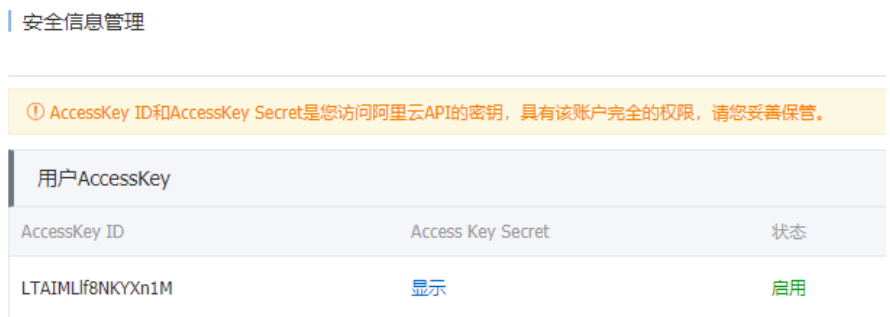

# 第八章 SMS--短信服务  

## 8.1 短信服务介绍  

短信服务（Short Message Service）是阿里云为用户提供的一种通信服务的能力。  

> 产品优势：覆盖全面、高并发处理、消息堆积处理、开发管理简单、智能监控调度
> 产品功能：短信通知、短信验证码、推广短信、异步通知、数据统计
> 应用场景：短信验证码、系统信息推送、推广短信等  


## 8.2 短信服务使用  

接下来,我们使用短信验证码功能来演示短信服务的使用。流程如下  


### 8.2.1 准备工作  

#### 8.2.1.1 实名认证  

https://help.aliyun.com/document_detail/48263.html?spm=a2c4g.11186623.2.25.1f9415ec9MLqKD

#### 8.2.1.2 开通短信服务  


#### 8.2.1.3 申请认证秘钥  



#### 8.2.1.4 申请短信签名  


#### 8.2.1.5 申请短信模板  


### 8.2.2 短信服务API介绍  

#### 8.2.2.1 短信发送(SendSms)  

调用SendSms发送短信。  

**请求参数**  

| 名称          | 类型   | 是否必 选 | 示例值          | 描述                         |
| ------------- | ------ | --------- | --------------- | ---------------------------- |
| PhoneNumbers  | String | 是        | 15900000000     | 接收短信的手机号码。         |
| SignName      | String | 是        | 阿里云          | 短信签名名称。               |
| TemplateCode  | String | 是        | SMS_153055065   | 短信模板ID。                 |
| TemplateParam | String | 否        | {"code":"1111"} | 短信模板变量的值， JSON格 式 |

**返回数据**  

| 名称      | 类型   | 示例值                   | 描述                                      |
| --------- | ------ | ------------------------ | ----------------------------------------- |
| BizId     | String | 900619746936498440^0     | 发送回执ID，可根据它查询具体的发送 状态。 |
| Code      | String | OK                       | 请求状态码。返回OK代表请求成功。          |
| Message   | String | OK                       | 状态码的描述。                            |
| RequestId | String | F655A8D5-B967-440B- 8683 | 请求ID。                                  |

#### 8.2.2.2 短信查询(QuerySendDetails)  

调用`QuerySendDetails`接口查看短信发送记录和发送状态。  

**请求参数**  

| 名称        | 类型   | 是否必 选 | 示例值         | 描述                                    |
| ----------- | ------ | --------- | -------------- | --------------------------------------- |
| CurrentPage | Long   | 是        | 1              | 分页查看，指定发送记录的的当 前页码。   |
| PageSize    | Long   | 是        | 10             | 分页查看，指定每页显示的短信 记录数量。 |
| PhoneNumber | String | 是        | 15900000000    | 接收短信的手机号码。                    |
| SendDate    | String | 是        | 20181228       | 短信发送日期，支持查询最近30 天的记录。 |
| BizId       | String | 否        | 134523^4351232 | 发送回执ID，即发送流水号。              |

**返回数据**  

| 名称              | 类型   | 示例值        | 描述                             |
| ----------------- | ------ | ------------- | -------------------------------- |
| Code              | String | OK            | 请求状态码。返回OK代表请求成功。 |
| Message           | String | OK            | 状态码的描述。                   |
| RequestId         | String | 819BE656-D2E0 | 请求ID。                         |
| SmsSendDetailDTOs | Array  |               | 短信发送明细。                   |
| TotalCount        | String | 1             | 短信发送总条数                   |

#### 8.2.2.3 功能测试  

第1步: 引入阿里云服务依赖  

```xml
<!--短信发送-->
<dependency>
    <groupId>com.alibaba.cloud</groupId>
    <artifactId>spring-cloud-alicloud-sms</artifactId>
</dependency>
```

第2步: 使用阿里云提供的Demo测试短信发送  

```java
public class SmsDemo {
    //产品名称:云通信短信API产品,开发者无需替换
    static final String product = "Dysmsapi";
    //产品域名,开发者无需替换
    static final String domain = "dysmsapi.aliyuncs.com";
    // TODO 此处需要替换成开发者自己的AK(在阿里云访问控制台寻找)
    static final String accessKeyId = "yourAccessKeyId";
    static final String accessKeySecret = "yourAccessKeySecret";
    //短信发送
    public static SendSmsResponse sendSms() throws ClientException {
        //可自助调整超时时间
        System.setProperty("sun.net.client.defaultConnectTimeout", "10000");
        System.setProperty("sun.net.client.defaultReadTimeout", "10000");
        //初始化acsClient,暂不支持region化
        IClientProfile profile = DefaultProfile.getProfile("cn-hangzhou",
                                                           accessKeyId, accessKeySecret);
        DefaultProfile.addEndpoint("cn-hangzhou", "cn-hangzhou", product,
                                   domain);
        IAcsClient acsClient = new DefaultAcsClient(profile);
        //组装请求对象-具体描述见控制台-文档部分内容
        SendSmsRequest request = new SendSmsRequest();
        //必填:待发送手机号
        request.setPhoneNumbers("15000000000");
        //必填:短信签名-可在短信控制台中找到
        request.setSignName("云通信");
        //必填:短信模板-可在短信控制台中找到
        request.setTemplateCode("SMS_1000000");
        //可选:模板中的变量替换JSON串,如模板内容为"亲爱的${name},您的验证码为${code}"时,
        此处的值为
            request.setTemplateParam("{\"name\":\"Tom\", \"code\":\"123\"}");
        //选填-上行短信扩展码(无特殊需求用户请忽略此字段)
        //request.setSmsUpExtendCode("90997");
        //可选:outId为提供给业务方扩展字段,最终在短信回执消息中将此值带回给调用者
        request.setOutId("yourOutId");
        //hint 此处可能会抛出异常,注意catch
        SendSmsResponse sendSmsResponse = acsClient.getAcsResponse(request);
        return sendSmsResponse;
    } 
    //短信查询
    public static QuerySendDetailsResponse querySendDetails(String bizId) throws
        ClientException {
        //可自助调整超时时间
        System.setProperty("sun.net.client.defaultConnectTimeout", "10000");
        System.setProperty("sun.net.client.defaultReadTimeout", "10000");
        //初始化acsClient,暂不支持region化
        IClientProfile profile = DefaultProfile.getProfile("cn-hangzhou",
                                                           accessKeyId, accessKeySecret);
        DefaultProfile.addEndpoint("cn-hangzhou", "cn-hangzhou", product,
                                   domain);
        IAcsClient acsClient = new DefaultAcsClient(profile);
        //组装请求对象
        QuerySendDetailsRequest request = new QuerySendDetailsRequest();
        //必填-号码
        request.setPhoneNumber("15000000000");
        //可选-流水号
        request.setBizId(bizId);
        //必填-发送日期 支持30天内记录查询,格式yyyyMMdd
        SimpleDateFormat ft = new SimpleDateFormat("yyyyMMdd");
        request.setSendDate(ft.format(new Date()));
        //必填-页大小
        request.setPageSize(10L);
        //必填-当前页码从1开始计数
        request.setCurrentPage(1L);
        //hint 此处可能会抛出异常,注意catch
        QuerySendDetailsResponse querySendDetailsResponse =
            acsClient.getAcsResponse(request);
        return querySendDetailsResponse;
    }

    public static void main(String[] args) throws ClientException,
    InterruptedException {
        //发短信
        SendSmsResponse response = sendSms();
        System.out.println("短信接口返回的数据----------------");
        System.out.println("Code=" + response.getCode());
        System.out.println("Message=" + response.getMessage());
        System.out.println("RequestId=" + response.getRequestId());
        System.out.println("BizId=" + response.getBizId());
        Thread.sleep(3000L);
        //查明细
        if(response.getCode() != null && response.getCode().equals("OK")) {
            QuerySendDetailsResponse querySendDetailsResponse =
                querySendDetails(response.getBizId());
            System.out.println("短信明细查询接口返回数据----------------");
            System.out.println("Code=" + querySendDetailsResponse.getCode());
            System.out.println("Message=" +
                               querySendDetailsResponse.getMessage());
            int i = 0;
            for(QuerySendDetailsResponse.SmsSendDetailDTO smsSendDetailDTO :
                querySendDetailsResponse.getSmsSendDetailDTOs())
            {
                System.out.println("SmsSendDetailDTO["+i+"]:");
                System.out.println("Content=" + smsSendDetailDTO.getContent());
                System.out.println("ErrCode=" + smsSendDetailDTO.getErrCode());
                System.out.println("OutId=" + smsSendDetailDTO.getOutId());
                System.out.println("PhoneNum=" +
                                   smsSendDetailDTO.getPhoneNum());
                System.out.println("ReceiveDate=" +
                                   smsSendDetailDTO.getReceiveDate());
                System.out.println("SendDate=" +
                                   smsSendDetailDTO.getSendDate());
                System.out.println("SendStatus=" +
                                   smsSendDetailDTO.getSendStatus());
                System.out.println("Template=" +
                                   smsSendDetailDTO.getTemplateCode());
            } 
            System.out.println("TotalCount=" +
                               querySendDetailsResponse.getTotalCount());
            System.out.println("RequestId=" +
                               querySendDetailsResponse.getRequestId());
        }
    }
}
```

### 8.3 下单之后发送短信  

1 在 shop-user 模块中加入sms依赖  

```xml
<!--短信发送-->
<dependency>
    <groupId>com.alibaba.cloud</groupId>
    <artifactId>spring-cloud-alicloud-sms</artifactId>
</dependency>
```

2 将阿里短信给出的demo封装成工具类  

```java
public class SmsUtil {
    //替换成自己申请的accessKeyId
    private static String accessKeyId = "LTAIMLlf8NKYXn1M";
    //替换成自己申请的accessKeySecret
    private static String accessKeySecret = "hqyW0zTNzeSIFnZhMEkOaZXVVcr3Gj";
    static final String product = "Dysmsapi";
    static final String domain = "dysmsapi.aliyuncs.com";
    /**
    * 发送短信
    * *
    * @param phoneNumbers 要发送短信到哪个手机号
    * @param signName 短信签名[必须使用前面申请的]
    * @param templateCode 短信短信模板ID[必须使用前面申请的]
    * @param param 模板中${code}位置传递的内容
    */
    public static void sendSms(String phoneNumbers, String signName, String
                               templateCode, String param) {
        try {
            System.setProperty("sun.net.client.defaultConnectTimeout", "10000");
            System.setProperty("sun.net.client.defaultReadTimeout", "10000");
            //初始化acsClient,暂不支持region化
            IClientProfile profile = DefaultProfile.getProfile("cn-hangzhou",
                                                               accessKeyId, accessKeySecret);
            DefaultProfile.addEndpoint("cn-hangzhou", "cn-hangzhou", product,
                                       domain);
            IAcsClient acsClient = new DefaultAcsClient(profile);
            SendSmsRequest request = new SendSmsRequest();
            request.setPhoneNumbers(phoneNumbers);
            request.setSignName(signName);
            request.setTemplateCode(templateCode);
            request.setTemplateParam(param);
            request.setOutId("yourOutId");
            SendSmsResponse sendSmsResponse = acsClient.getAcsResponse(request);
            if (!"OK".equals(sendSmsResponse.getCode())) {
                throw new RuntimeException(sendSmsResponse.getMessage());
            }
        } catch (Exception e) {
            e.printStackTrace();
            throw new RuntimeException("发送短信失败");
        }
    }
}
```

3 修改短信发送的服务  

```java
//发送短信的服务
@Slf4j
@Service("shopSmsService")
@RocketMQMessageListener(
    consumerGroup = "shop-user", //消费者组名
    topic = "order-topic",//消费主题
    consumeMode = ConsumeMode.CONCURRENTLY,//消费模式
    messageModel = MessageModel.CLUSTERING//消息模式
) 

public class SmsService implements RocketMQListener<Order> {
    @Autowired
    private UserDao userDao;
    //消费逻辑
    @Override
    public void onMessage(Order message) {
        log.info("接收到了一个订单信息{},接下来就可以发送短信通知了", message);
        //根据uid 获取手机号
        User user = userDao.findById(message.getUid()).get();
        //生成验证码
        StringBuilder builder = new StringBuilder();
        for (int i = 0; i < 6; i++) {
            builder.append(new Random().nextInt(9) + 1);
        } 
        String smsCode = builder.toString();
        Param param = new Param(smsCode);
        try {
            //发送短信 {"code":"123456"}
            SmsUtil.sendSms(user.getTelephone(), "黑马旅游网", "SMS_170836451",
                            JSON.toJSONString(param));
            log.info("短信发送成功");
        } catch (Exception e) {
            e.printStackTrace();
        }
    } 

    @Data
    @AllArgsConstructor
    @NoArgsConstructor
    class Param {
        private String code;
    }
}
```

